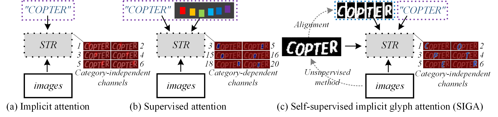
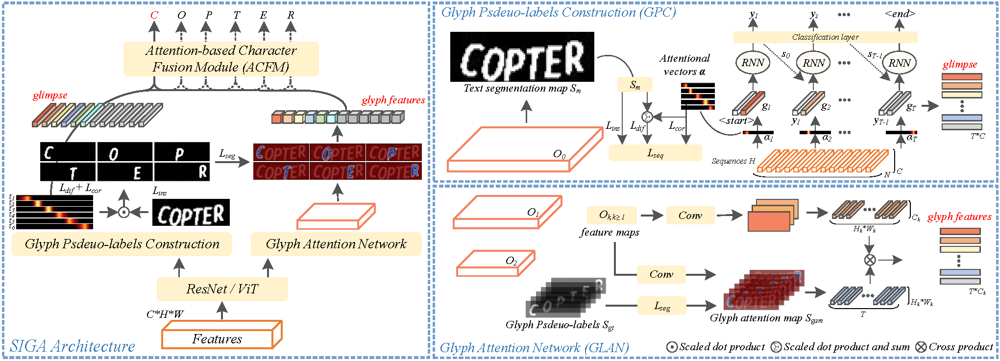
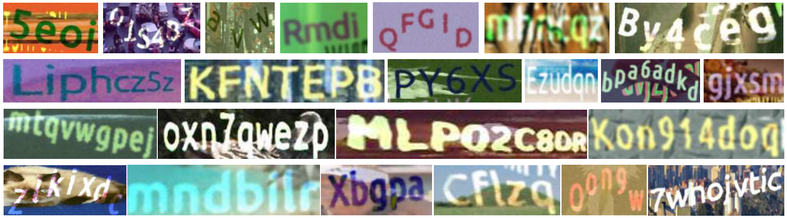
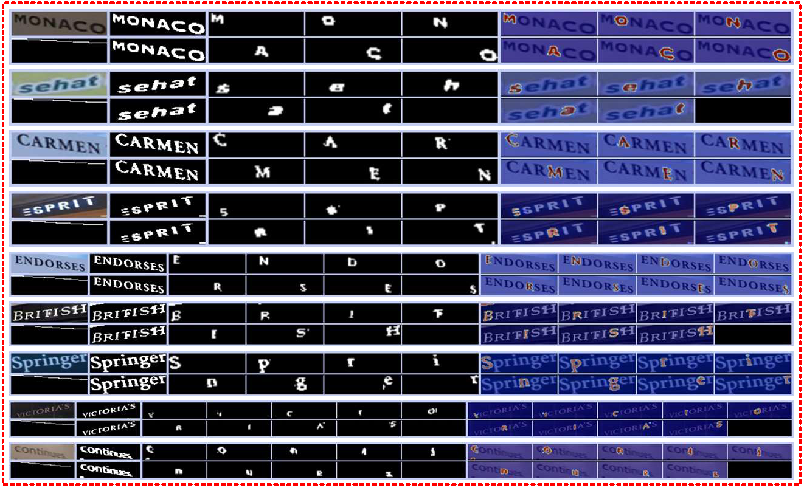
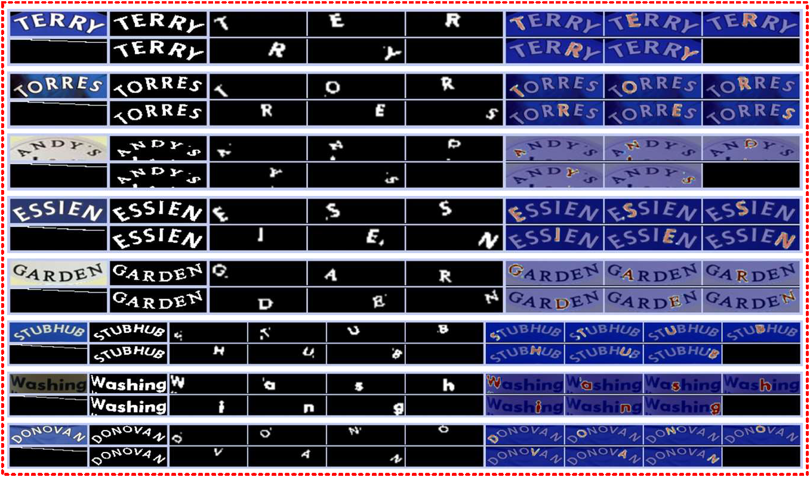
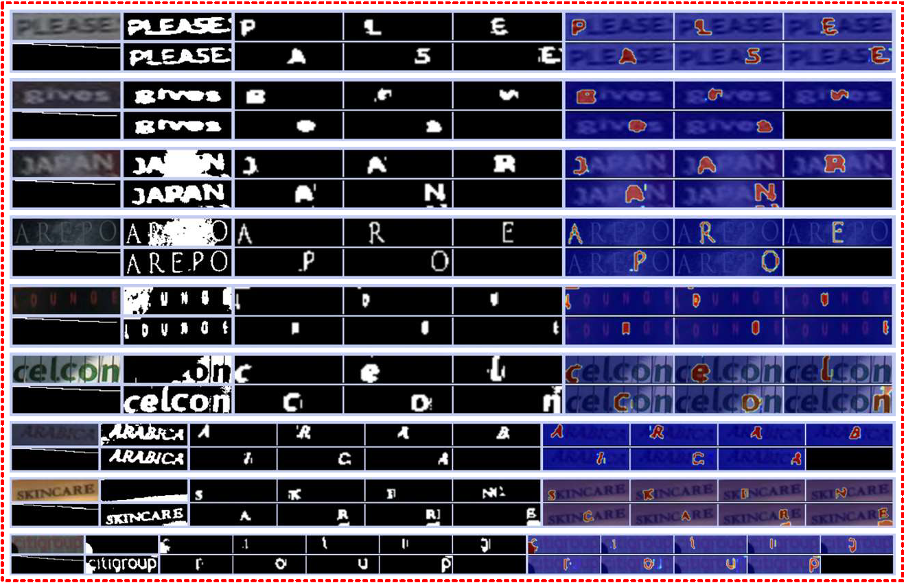

# Self-Supervised Implicit Glyph Attention for Text Recognition (CVPR2023)
This is the code of "Self-Supervised Implicit Glyph Attention for Text Recognition". 
For more details, please refer to our [CVPR2023 paper](https://openaccess.thecvf.com/content/CVPR2023/papers/Guan_Self-Supervised_Implicit_Glyph_Attention_for_Text_Recognition_CVPR_2023_paper.pdf) 
or [Poster](SIGA_poster.pdf) or [中文解读](https://www.techbeat.net/article-info?id=5152).

## Pipeline 


## Model architecture


## Environments
```bash
# V100 Ubuntu 16.04 Cuda 10
conda create -n SIGA python==3.7.0
source activate SIGA
pip install torch==1.5.1+cu101 torchvision==0.6.1+cu101 -f https://download.pytorch.org/whl/torch_stable.html
pip install tensorboard==1.15.0
pip install tensorboardX==2.2
pip install opencv-python
pip install Pillow LMDB nltk six natsort scipy
# 3090 Ubuntu 16.04 Cuda 11
conda create -n SIGA python==3.7.0
source activate SIGA
pip install torch==1.10.1+cu111 torchvision==0.11.2+cu111 torchaudio==0.10.1 -f https://download.pytorch.org/whl/cu111/torch_stable.html
pip install tensorboard==2.11.2
pip install tensorboardX==2.2
pip install opencv-python
pip install Pillow LMDB nltk six natsort scipy
# if you meet bug about setuptools
# pip uninstall setuptools
# pip install setuptools==58.0.4
```
## Data
```bash
-- root_path
    --training
        --MJ
        --ST
    --validation
    --evaluation
        --SVT
        --IIIK
        --...
```

## Highlights
- **Dataset link:**
  - [Synth data and benchmark](https://github.com/FangShancheng/ABINet/README.md)
  - [MPSC](https://drive.google.com/file/d/1awBUrj30s5VLxk-B0EFkieeIcNrETVTX/view?usp=drive_link)
    
  - [ArbitText](https://drive.google.com/file/d/1D-pN5u0KOm79Ot51jh-9_rEdSt9oK_vK/view?usp=drive_link)
    
- **weight link:**
  - [SIGA<sub>R</sub>](https://drive.google.com/file/d/1Nulplr3LnMzJ1AgG5pkCyUCUeqddR0_P/view?usp=drive_link) *The model is trained on V100 platform*.

## Mask preparation
  - optional, K-means results (please refer to [CCD](https://github.com/TongkunGuan/CCD/tree/main/mask_create))
```bash
cd ./mask_create
run generate_mask.py #parallelly process mask --> lmdb file
run merge.py #merge multiple lmdb files into single file
```
  
## Training 
```bash
CUDA_VISIBLE_DEVICES=0,1 python -m torch.distributed.launch --nproc_per_node=2 train.py --model_name TRBA --exp_name SIGA --Aug --batch_size 320 --num_iter 160000 --select_data synth --benchmark_all_eval --train_data /xxx/dataset/data_lmdb/training/label/Synth/ --eval_data /xxx/dataset/data_lmdb/evaluation/ --mask_path /xxx/dataset/data_lmdb/Mask(optional) --workers 12
```

## Test and eval
```bash
python test.py --eval_data /xxx/xxx --select_data xxx
```

## Visualization






### TODO
- [ ] Release SIGA_S, SIGA_T code
- [ ] Refactor and clean code

## Citation
```bash
If you find our method useful for your reserach, please cite

@inproceedings{guan2023self,
  title={Self-Supervised Implicit Glyph Attention for Text Recognition},
  author={Guan, Tongkun and Gu, Chaochen and Tu, Jingzheng and Yang, Xue and Feng, Qi and Zhao, Yudi and Shen, Wei},
  booktitle={Proceedings of the IEEE/CVF Conference on Computer Vision and Pattern Recognition},
  pages={15285--15294},
  year={2023}
}
```
## License
```bash
- This code are only free for academic research purposes and licensed under the 2-clause BSD License - see the LICENSE file for details.
```
